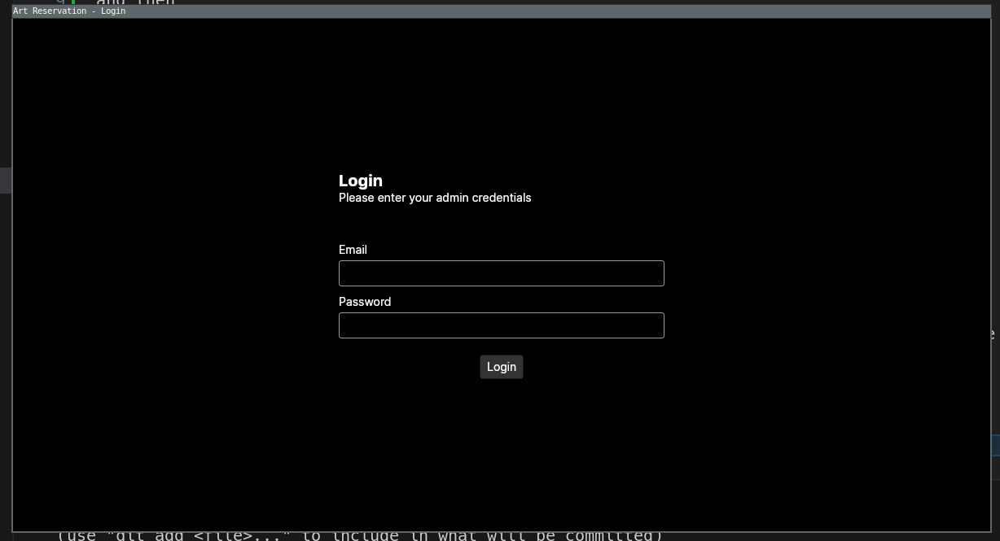
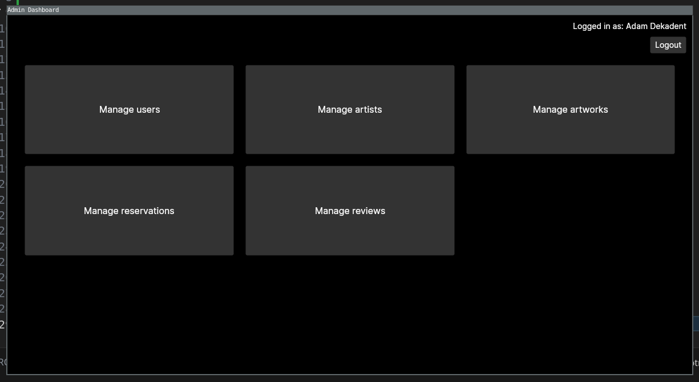
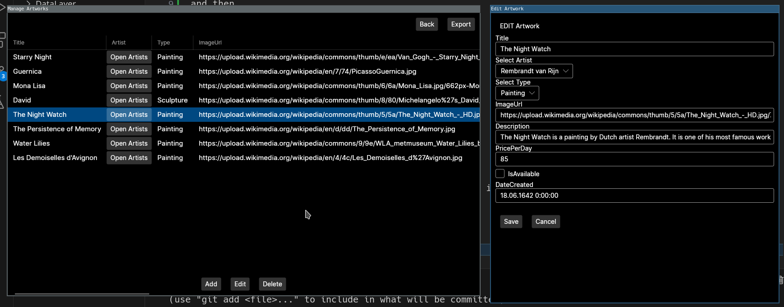
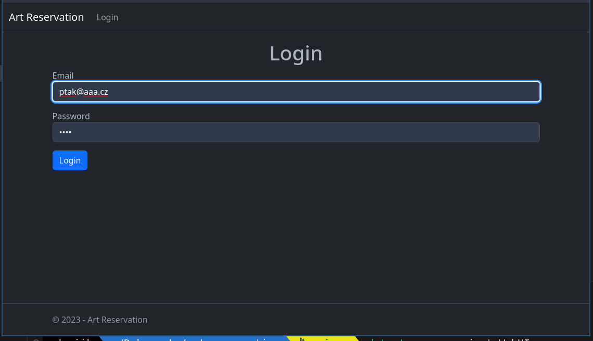
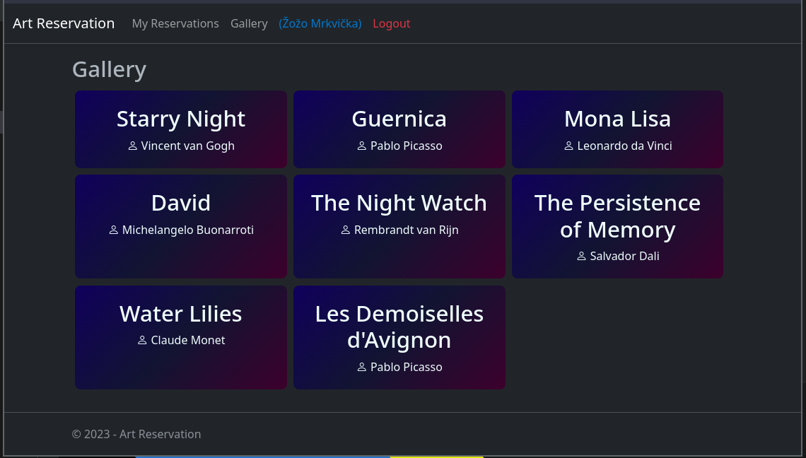
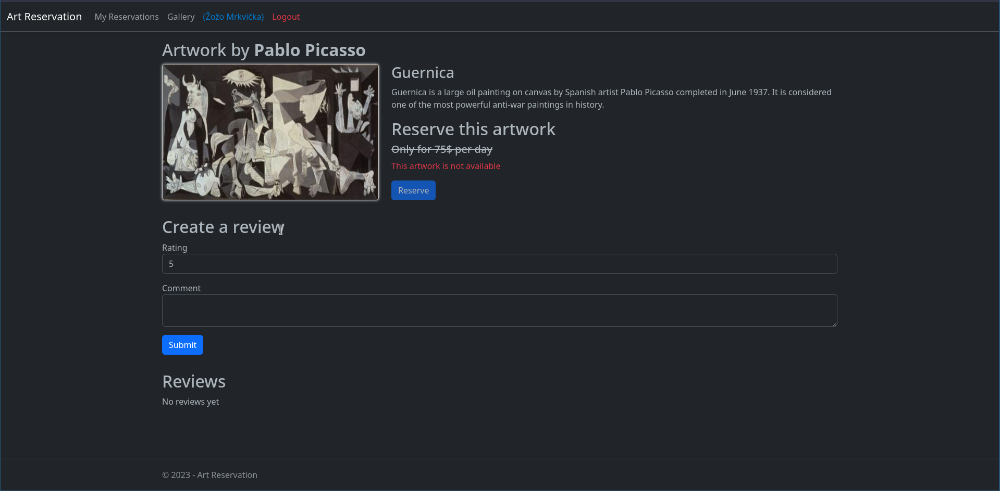
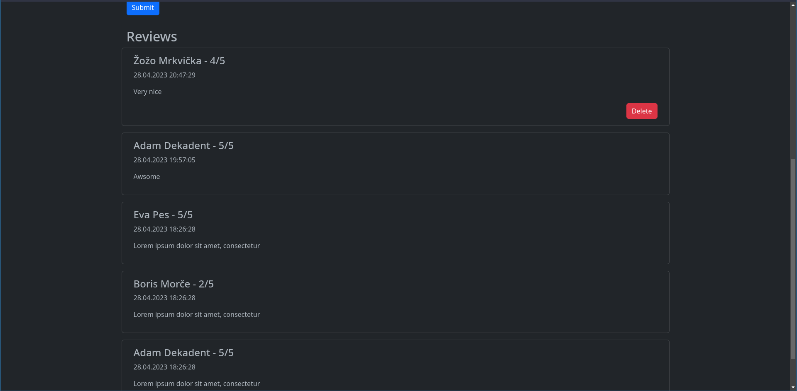
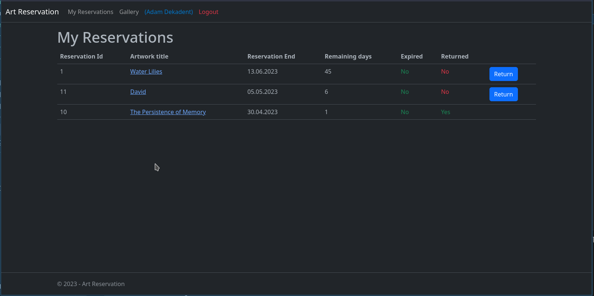

# art-reservation
Art reservation project for my c# course


## Quick Start
```sh
$ dotnet run --project AdminUI filldata
```
and then
```sh
$ dotnet run --project AdminUI
```
or
```sh
$ dotnet run --project WebUI
```

## Project goals
- [x] Hand made ORM
- [x] Use reflection somewhere
- [x] Create wpf app (I used Avalonia)
- [x] Use async or thread
- [x] Create web using asp.net 
- [x] Create login on web - doesn't matter how (I did it with singleton xd.. don't judge me :))
- [x] Some CRUD operations
- [x] Form validation

## Examples
















.. all working and twerking c: